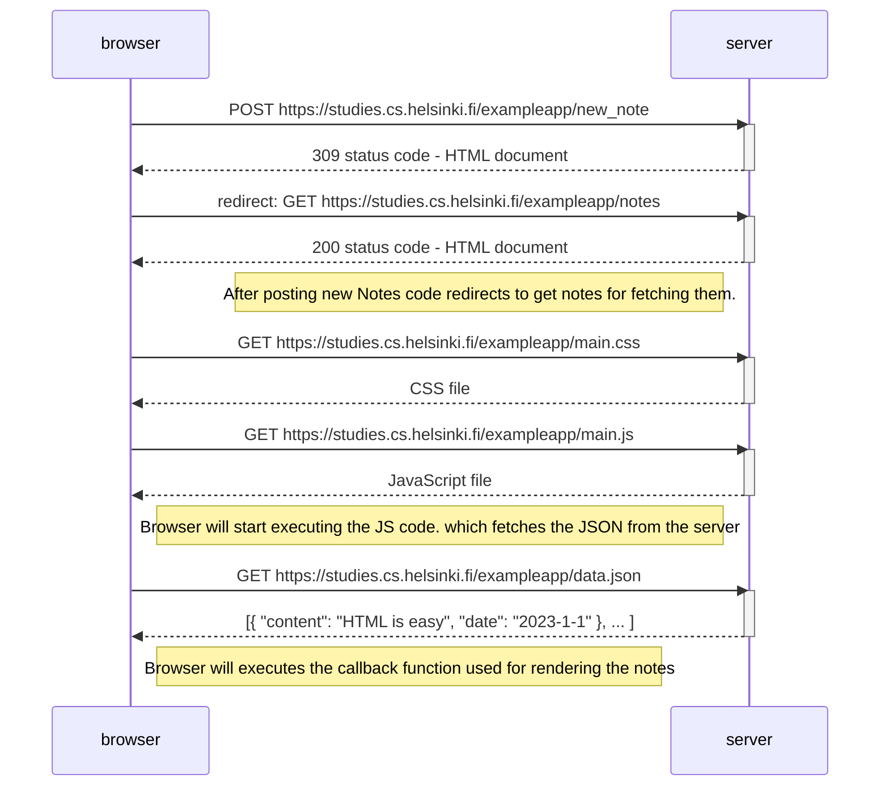

# exercise-4

```mermaid
sequenceDiagram
    participant browser
    participant server
    
    browser->>server: POST https://studies.cs.helsinki.fi/exampleapp/new_note
    activate server
    server-->>browser: 309 status code - HTML document
    deactivate server
    
    browser->>server: redirect: GET https://studies.cs.helsinki.fi/exampleapp/notes
    activate server
    server-->>browser: 200 status code - HTML document
    deactivate server
    
    Note left of server: After posting new Notes code redirects to get notes for fetching them.
    
    browser->>server: GET https://studies.cs.helsinki.fi/exampleapp/main.css
    activate server
    server-->>browser: CSS file
    deactivate server
    
    browser->>server: GET https://studies.cs.helsinki.fi/exampleapp/main.js
    activate server
    server-->>browser: JavaScript file
    deactivate server
    
    Note right of browser: Browser will start executing the JS code. which fetches the JSON from the server
    
    browser->>server: GET https://studies.cs.helsinki.fi/exampleapp/data.json
    activate server
    server-->>browser: [{ "content": "HTML is easy", "date": "2023-1-1" }, ... ]
    deactivate server    

    Note right of browser: Browser will executes the callback function used for rendering the notes
    

```
