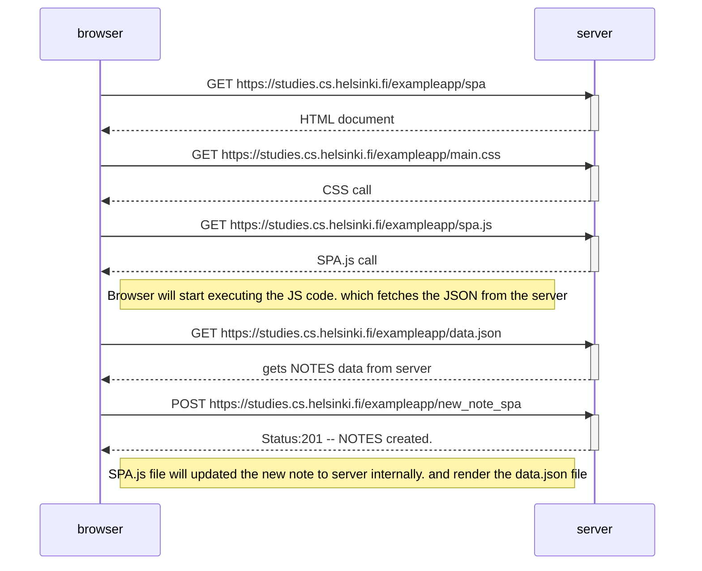

# exercise-6

Single Page Application (SPA) for creating new notes.. - /notes.

```mermaid
  sequenceDiagram
    participant browser
    participant server
    
    browser->>server: GET https://studies.cs.helsinki.fi/exampleapp/spa
    activate server
    server-->>browser: HTML document
    deactivate server
    
    browser->>server: GET https://studies.cs.helsinki.fi/exampleapp/main.css
    activate server
    server-->>browser: CSS call
    deactivate server
    
    browser->>server: GET https://studies.cs.helsinki.fi/exampleapp/spa.js
    activate server
    server-->>browser: SPA.js call
    deactivate server
    
    Note right of browser: Browser will start executing the JS code. which fetches the JSON from the server
    
    browser->>server: GET https://studies.cs.helsinki.fi/exampleapp/data.json
    activate server
    server-->>browser: gets NOTES data from server
    deactivate server
    
    browser->>server: POST https://studies.cs.helsinki.fi/exampleapp/new_note_spa
    activate server
    server-->>browser: Status:201 -- NOTES created.
    deactivate server
    
    Note right of browser: SPA.js file will updated the new note to server internally. and render the data.json file
    
    
```
